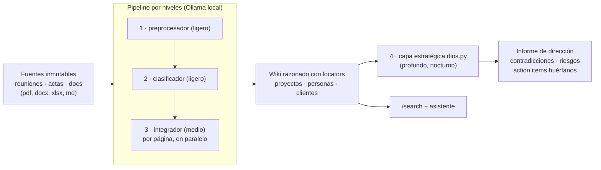

# ZOE — memoria organizacional local-first


Las empresas generan miles de conversaciones, documentos y decisiones que terminan
perdidas. ZOE convierte todo ese conocimiento en una **memoria consultable con
trazabilidad completa**: cada afirmación cita la fuente exacta de la que salió, y
todo corre en local — ningún dato sale de la máquina.


> Prototipo funcional extraído de un sistema en uso real (con los datos reales fuera
> de este repo). Qué está verificado y qué está en diseño: [Estado](#estado).

## Por qué

- **El conocimiento se evapora.** Reuniones que nadie relee, decisiones sin registro,
  contexto que se marcha cuando alguien deja la empresa.
- **Un chatbot con RAG no da confianza.** Responde y no sabes de dónde lo saca. ZOE
  compila el conocimiento en un wiki razonado donde cada dato lleva su *locator*
  `(src-reunion-NN, fecha)`: puedes ir a la fuente original y comprobarlo.
- **El cloud no siempre es opción.** Las reuniones de una empresa son su información
  más sensible. Aquí los modelos son de Ollama y no hay una sola llamada externa.

Y una tesis de producto: ZOE no es un chatbot — está diseñado para **trabajar solo**,
digerir información de noche y amanecer con informes, conclusiones y alertas. La
orquestación por ritmos (día/noche) está en [docs/vision.md](docs/vision.md) y el
hardware para exprimirla en [docs/hardware.md](docs/hardware.md).

## Arquitectura



Principios de diseño:

- **Local-first**: los modelos son de Ollama; no hay ninguna llamada cloud en el código.
- **El modelo más barato que aguante la tarea**: roles → niveles (ligero/medio/profundo)
  configurables en caliente desde la página `/modelos`, sin tocar código.
- **Contrato en código, no en prompt**: parseo tolerante de la salida del LLM,
  verificación mecánica de que las reescrituras no pierden locators, guards
  anti zip-bomb y límites de recursos en la ingesta de documentos.
- **El dominio es configuración**: el motor no sabe de ningún sector; el perfil de la
  organización vive en `data/perfil.txt` (ver `examples/perfil.txt.example`).

## Demo en 5 minutos

Requisitos: Python 3.11+. [Ollama](https://ollama.com) solo para el paso con LLM.

```bash
python3 -m venv .venv && source .venv/bin/activate
pip install -r requirements.txt

bash run.sh            # backend FastAPI en :8900
bash test_smoke.sh     # health + ingest + search end-to-end (sin LLM)

# Pipeline completo con el dataset sintético (requiere Ollama con un modelo):
mkdir -p data && cp examples/resumenes-demo.txt data/resumenes.txt
cp examples/perfil.txt.example data/perfil.txt
python3 ingest_wiki.py                  # compila las 3 reuniones demo al wiki
python3 examples/build_demo_index.py
curl -H "Authorization: Bearer $(cat data/upload_token.txt)" "localhost:8900/search?q=embalaje"
```

El endpoint `/upload` acepta solo las extensiones de la allowlist (`.pdf` `.docx`
`.xlsx` `.pptx` `.txt` `.md` `.csv`, máx. 100 MB por archivo, límite aplicado en
streaming) y las pasa por la misma tubería. Un detector de patrones de inyección
aparta los archivos sospechosos a `data/revisar/` (visible en `/inbox`) con su
`.motivo.txt`: requieren aprobación manual — moverlos de vuelta a `data/inbox/`
es aprobarlos (esa segunda pasada salta el detector). El token se genera solo en
`data/upload_token.txt` al primer arranque.

## Qué hay en el repo

| Pieza | Qué hace |
|---|---|
| `app.py` | Backend FastAPI: `/ingest`, `/search` (FTS5), subida con bandeja (`/subir`, `/upload`, `/inbox`), configuración de modelos (`/modelos`, `/route`) |
| `ingest_wiki.py` | Pipeline de ingesta por niveles, O(cambio): condensa → clasifica → integra por página en paralelo → índice → log |
| `models.py` | Broker de modelos Ollama-only: roles → niveles → modelo+hilos, router IA, reintentos |
| `extract.py` | PDF/DOCX/XLSX/TXT/MD → markdown con locators de posición (página/hoja) |
| `dios.py` | Capa estratégica: digiere el wiki completo y escribe el informe de dirección |
| `examples/` | Dataset sintético (3 reuniones inventadas) + indexador demo standalone |

## Estado

**Verificado:** ingesta multi-fuente → wiki con locators (con caso de regresión para
el error de atribución más traicionero), búsqueda FTS5, subida de documentos con
hardening (zip-bomb guard, rlimits, prompts anti-injection), broker por niveles con
configuración en caliente, informes de dirección con citas (`dios.py`), suite de
regresión adversarial contra inyección (locators fabricados, instrucciones
embebidas, texto oculto) en CI.

**En diseño:** búsqueda híbrida BM25+vector en `/search`, edición por diff en el
integrador, planificador de ritmos ([docs/vision.md](docs/vision.md)), interfaz
visual (ver [Interfaz](#interfaz-en-construcción)).

**Integración opcional:** acoplable a un runtime de agente
([OpenClaw](https://github.com/openclaw/openclaw)) vía `ZOE_COMPOSE_FILE` para que un
agente conversacional consulte la misma memoria; el repo funciona standalone sin él.
Variables de entorno en [`.env.example`](.env.example).

## Interfaz (en construcción)

ZOE tiene una interfaz web propia en desarrollo, no incluida en esta versión.
No es un chat genérico encima de la API: está diseñada a medida de cómo se
consume una memoria organizacional —

- **El wiki como primer ciudadano**: navegación por páginas y enlaces
  [[wiki-*]], no por hilos de conversación.
- **Locators clicables**: de cualquier afirmación a su fuente inmutable en un
  clic — la trazabilidad deja de ser un formato de cita y pasa a ser UX.
- **La bandeja y los ritmos, visibles**: qué hay en cola, qué se procesó esta
  noche, qué escribió el informe de dirección al amanecer.

Mientras tanto, todo lo que hace la interfaz se puede hacer ya: los endpoints
(`/subir`, `/search`, `/modelos`, `/inbox`) son la misma API que consumirá ella.
El backend no cambia; la interfaz es una capa encima.

## Gobernanza y uso responsable

Pensado para desplegarse sobre información real de una organización, y documentado
como tal: [uso responsable y supervisión humana](docs/uso-responsable.md) ·
[limitaciones conocidas](docs/limitaciones.md) · [evaluación de riesgos](docs/riesgos.md) ·
[privacidad y RGPD](docs/privacidad-rgpd.md) · [registro de modelos](docs/modelos.md).

## Autor

**Javier Núñez Paredes — J13**

[](https://www.linkedin.com/in/javier-n%C3%BA%C3%B1ez-paredes-81a66b159/)
[](mailto:javiernunezparedes@gmail.com)

Licencia [MIT](LICENSE).
