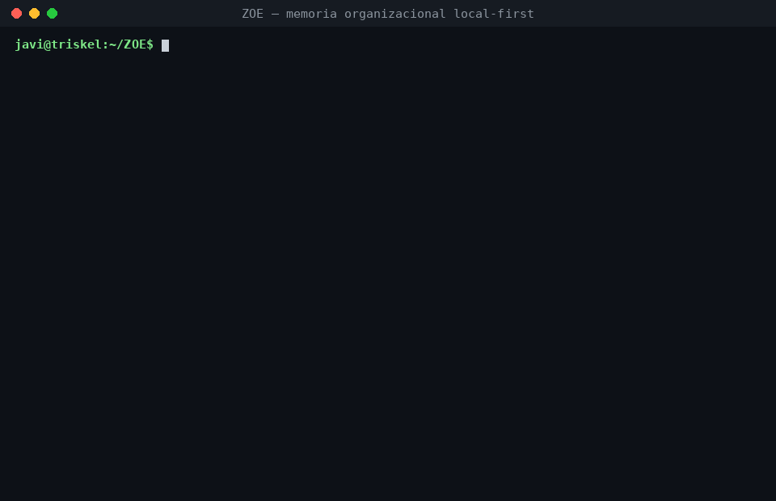
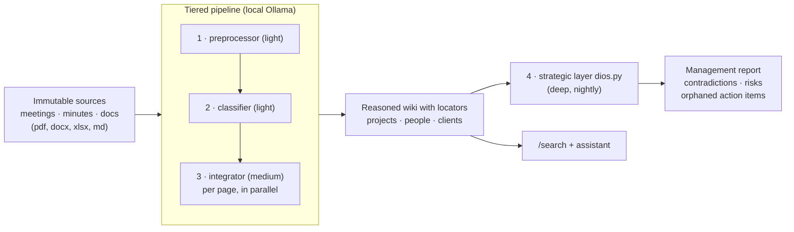

🇬🇧 English · [🇪🇸 Español](README.es.md)

# ZOE — local-first organizational memory


*Docs in `docs/` and code comments are in Spanish.*

Companies generate thousands of conversations, documents and decisions that end up
lost. ZOE turns all that knowledge into a **queryable memory with full
traceability**: every claim cites the exact source it came from, and everything
runs locally — no data leaves the machine.



> Working prototype extracted from a system in real use (with the real data kept
> out of this repo). What is verified and what is in design: [Status](#status).

## Why

- **Knowledge evaporates.** Meetings nobody rereads, decisions with no record,
  context that walks out when someone leaves the company.
- **A RAG chatbot doesn't earn trust.** It answers and you don't know where it got
  it from. ZOE compiles knowledge into a reasoned wiki where every fact carries its
  *locator* `(src-reunion-NN, date)`: you can go to the original source and check it.
- **The cloud is not always an option.** A company's meetings are its most sensitive
  information. Here the models come from Ollama and there is not a single external call.

And a product thesis: ZOE is not a chatbot — it is designed to **work on its own**,
digest information overnight and wake up with reports, conclusions and alerts. The
day/night rhythm orchestration is in [docs/vision.md](docs/vision.md) and the
hardware to squeeze it in [docs/hardware.md](docs/hardware.md).

## Architecture



Design principles:

- **Local-first**: the models come from Ollama; there is no cloud call anywhere in the code.
- **The cheapest model that can hold the task**: roles → tiers (light/medium/deep)
  hot-configurable from the `/modelos` page, without touching code.
- **Contract in code, not in the prompt**: tolerant parsing of LLM output,
  mechanical verification that rewrites don't lose locators, anti zip-bomb guards
  and resource limits on document ingestion.
- **The domain is configuration**: the engine knows nothing about any sector; the
  organization's profile lives in `data/perfil.txt` (see `examples/perfil.txt.example`).

## 5-minute demo

Requirements: Python 3.11+. [Ollama](https://ollama.com) only for the LLM step.

```bash
python3 -m venv .venv && source .venv/bin/activate
pip install -r requirements.txt

bash run.sh            # FastAPI backend on :8900
bash test_smoke.sh     # health + ingest + search end-to-end (no LLM)

# Full pipeline with the synthetic dataset (requires Ollama with a model):
mkdir -p data && cp examples/resumenes-demo.txt data/resumenes.txt
cp examples/perfil.txt.example data/perfil.txt
python3 ingest_wiki.py                  # compiles the 3 demo meetings into the wiki
python3 examples/build_demo_index.py
curl -H "Authorization: Bearer $(cat data/upload_token.txt)" "localhost:8900/search?q=embalaje"
```

The `/upload` endpoint only accepts the allowlisted extensions (`.pdf` `.docx`
`.xlsx` `.pptx` `.txt` `.md` `.csv`, max 100 MB per file, limit enforced while
streaming) and pushes them through the same pipeline. An injection-pattern detector
quarantines suspicious files into `data/revisar/` (visible in `/inbox`) with their
`.motivo.txt`: they require manual approval — moving them back into `data/inbox/`
approves them (that second pass skips the detector). The token is generated
automatically in `data/upload_token.txt` on first start.

## What's in the repo

| Piece | What it does |
|---|---|
| `app.py` | FastAPI backend: `/ingest`, `/search` (FTS5), upload with inbox (`/subir`, `/upload`, `/inbox`), model configuration (`/modelos`, `/route`) |
| `ingest_wiki.py` | Tiered ingestion pipeline, O(change): condense → classify → integrate per page in parallel → index → log |
| `models.py` | Ollama-only model broker: roles → tiers → model+threads, AI router, retries |
| `extract.py` | PDF/DOCX/XLSX/TXT/MD → markdown with position locators (page/sheet) |
| `dios.py` | Strategic layer: digests the whole wiki and writes the management report |
| `examples/` | Synthetic dataset (3 invented meetings) + standalone demo indexer |

## Status

**Verified:** multi-source ingestion → wiki with locators (with a regression case
for the most treacherous attribution error), FTS5 search, document upload with
hardening (zip-bomb guard, rlimits, anti-injection prompts), tiered broker with hot
configuration, management reports with citations (`dios.py`), adversarial
regression suite against injection (fabricated locators, embedded instructions,
hidden text) in CI.

**In design:** hybrid BM25+vector search in `/search`, diff-based editing in the
integrator, rhythm scheduler ([docs/vision.md](docs/vision.md)), visual interface
(see [Interface](#interface-under-construction)).

**Optional integration:** attachable to an agent runtime
([OpenClaw](https://github.com/openclaw/openclaw)) via `ZOE_COMPOSE_FILE` so a
conversational agent queries the same memory; the repo works standalone without it.
Environment variables in [`.env.example`](.env.example).

## Interface (under construction)

ZOE has its own web interface under development, not included in this release.
It is not a generic chat on top of the API: it is designed around how an
organizational memory is actually consumed —

- **The wiki as a first-class citizen**: navigation by pages and [[wiki-*]]
  links, not by conversation threads.
- **Clickable locators**: from any claim to its immutable source in one click —
  traceability stops being a citation format and becomes UX.
- **The inbox and the rhythms, visible**: what's queued, what was processed
  overnight, what the management report wrote at dawn.

Meanwhile, everything the interface will do can already be done: the endpoints
(`/subir`, `/search`, `/modelos`, `/inbox`) are the same API it will consume.
The backend doesn't change; the interface is a layer on top.

## Governance and responsible use

Built to be deployed on an organization's real information, and documented as
such: [responsible use and human oversight](docs/uso-responsable.md) ·
[known limitations](docs/limitaciones.md) · [risk assessment](docs/riesgos.md) ·
[privacy & GDPR](docs/privacidad-rgpd.md) · [model registry](docs/modelos.md).

## Author

**Javier Núñez Paredes — J13**

[](https://www.linkedin.com/in/javier-n%C3%BA%C3%B1ez-paredes-81a66b159/)
[](mailto:javiernunezparedes@gmail.com)

License: [MIT](LICENSE).
